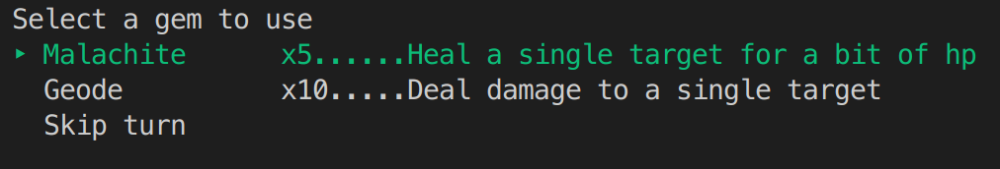
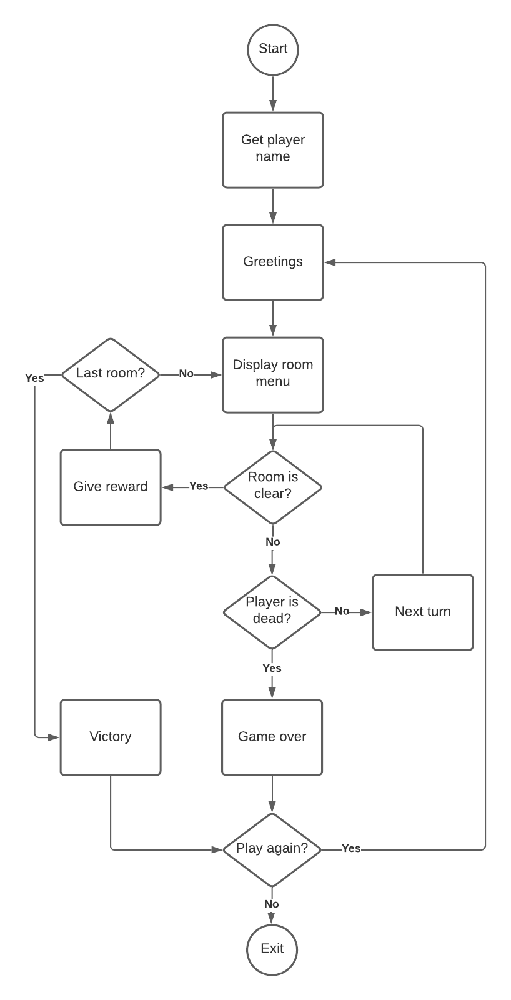
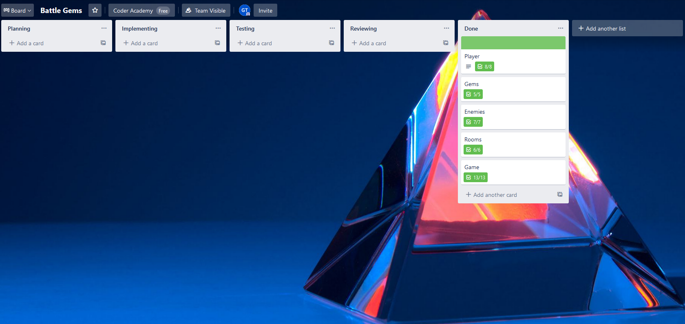
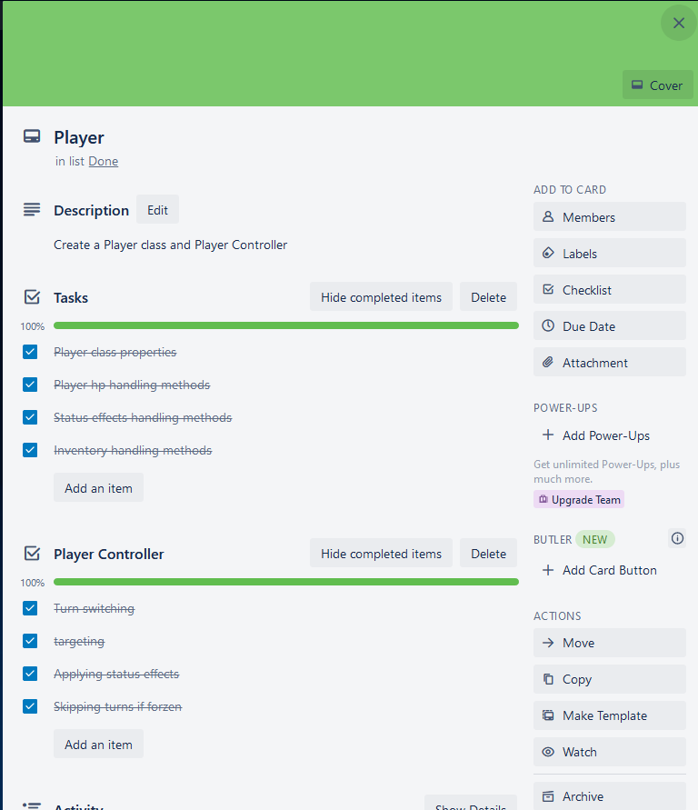
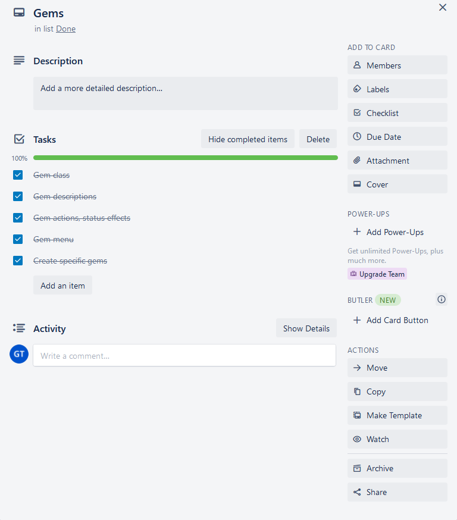
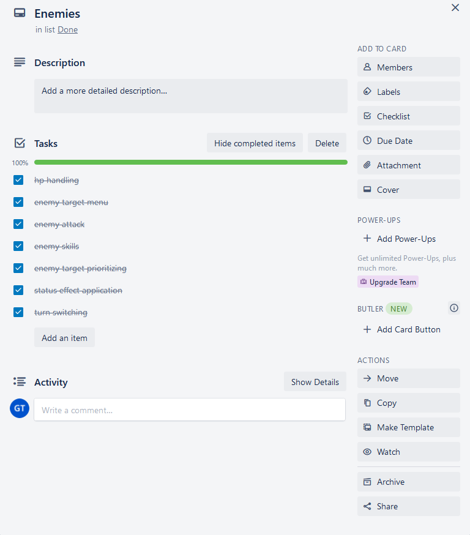
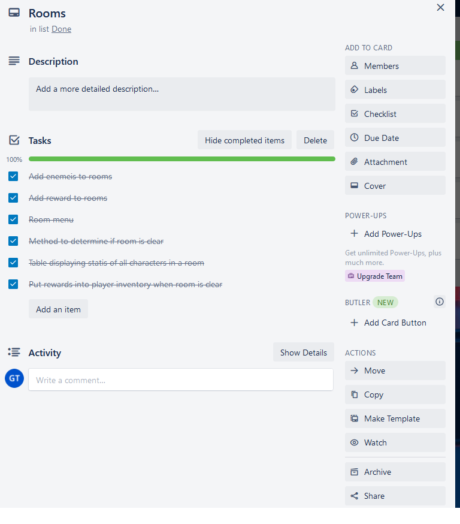
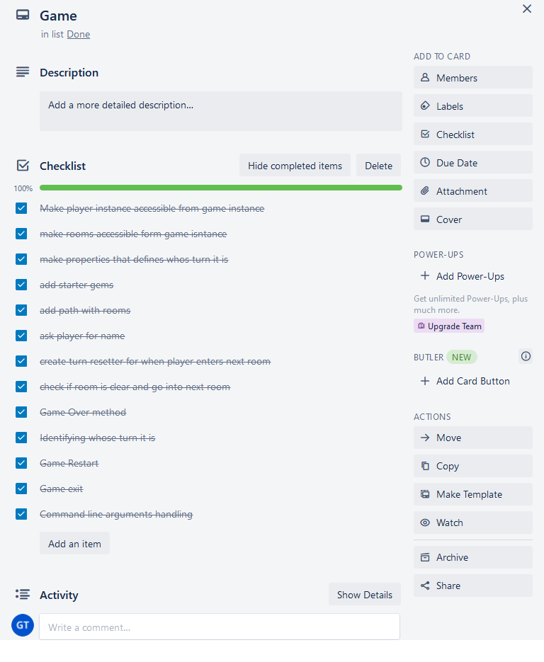

# Turn based RPG terminal game Battle Gems

## Purpose
Battle Gems is a game that can be played in a terminal. The game is a turn based RPG where player goes from level to level to chose a room to enter. In each room there will be enemies to fight and a reward if player cealrs the room.

The game is for users to use at their leisure and it is a fun little project of mine to develop my programming skills and imrove my understanding of OOP.

The game is made for people who like playing games and specifically turn based RPGs. The game will have a special appeal for those who love gemstones, since gems is the main theme of the game. Also the game is made in Ruby programming language and will require Ruby installed. So it will most likely be played by programmers who are learning or familiar with Ruby and basic terminal commands.

A user would install the game by running the shell script, which will install all the dependenicies and launch the game. The game is played in terminal and therefore text based. It accepts user keyboard input to navigate form room to room, pick a gem to use and choose a target.

## Features
### Gems
The main theme of the game is gemstones. Use gemstones to get various effects. From dealing damage, to gaining several turns in a row. The gems are implemented as a class called CrystalGem. And instance of a CrystalGem class has properties:
 - name: String
 - target: Symbol
 - description: String
 - action : Procedure

 The action part bears a special significance since it is resonsible for what happens when a gem instance is used in the game. For example:
 ```ruby
 lapis_lazuli = CrystalGem.new(
      name: "Lapis Lazuli",
      target: :aoe,
      description: "Deals damage and applies frozen status to all enemies",
      action: proc { |targets|
        targets.reduce("") { |o, t|
          o += " > #{t.damage(30)}. #{t.add_status(:frozen, {turns: 2})}\n"
        }
      }
    )
 ```
 In here a gem "Lapis Lazuli" is applied on multiple targets and it's `action` property is a procedure that iterates over all targets and calls `damage` and `add_status` methods and returns a string with status update messages to be displayed.

 ### Enemies
 The game features a variety of enemies which also can use gems to various effects. The `Enemy` class inherits basic features such as `hp`, `name`, `status` etc. from `Character` class. The features that are specific to `Enemy` instance are:
 - attack_power: Integer
 - attack_skill: Procedure or nil
 - defense: skill: Procedure or nil

 The enemies powers derive from Gems. So for example condsider an `Enemy` instance `amerub`

 ```ruby
 amerub = Enemy.new(
     name: "Amerub",
     attack_gem: GemAssets.ruby,
     defense_gem: GemAssets.amethyst,
     attack_power: 30,
     total_hp: 70
    )
 ```

 The initalize method accepts two `Gem` instances, in this case `ruby` and `amethyst`. The `action` property of gems becomes `attack_gem` and `defense_gem` properties of `amerub` instance.

### Gems menu
When it is player's turn they are presented with a menu of gems in theor inventory to choose from. The menu is implemented with TTY-prompt gem:



If the user presses `Ctrl + C` key combination during this the Error arises. This error is handled so that instead of wall of text the application simply exits.

```ruby
menu = rooms.each_with_index.map { |room, index| {name: room.description, value: index } }
begin
  @@prompt.select("Pick a room to enter", menu)
rescue TTY::Reader::InputInterrupt
  quit
end
```

## User interaction outline
To find out more about the game features, gems, enemies and rooms and status effects use the `ruby play.rb -info` command

When the game starts you will be asked to enter your name. Use keyboard to type your name in the terminal and press Enter. Then the game begins and you will be given a choice of which room to enter. Pick a room form the menu using arrow keys on the keyboard and press Enter. When you enter a room the battle begins. Player always goes first and you will be prompted to chose a gem to use form your inventory. In a similar way to picking a room a menu will appear where you can use arrow keys to pick a gem. Once you choose a gem to use a target menu will appear whith enemy names in the same order as they appear on the table. At the start of each turn a table appears with names current hp and status effects list of each character in the room. Player's name is always the last one in the table. Once your turn is over the table will appear again with updated state of all character in the room.

An error that can occur during the game is an unexpected exit with Ctrl + C command in the terminal during promt. This is handled to not display the standard error text and instead the game exits.

## Diagram

## Implementation plan
[Trello board link](https://trello.com/b/3885GjrL/battle-gems)







## Installation Instructions
Clone the repository:
`git clone https://github.com/Gleebo/terminal-app.git`
Run the shell script in the folder containg repository:
`./battle-gems.sh`
The script will make sure that all the gems needed are installed
Run the command in your terminal
`ruby play.rb`

Required software:
 - MacOS or Linux or WSL
 - Terminal
 - bash
 - Ruby version 2.7.2
